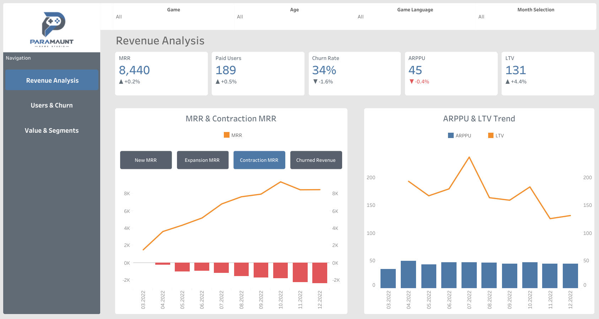
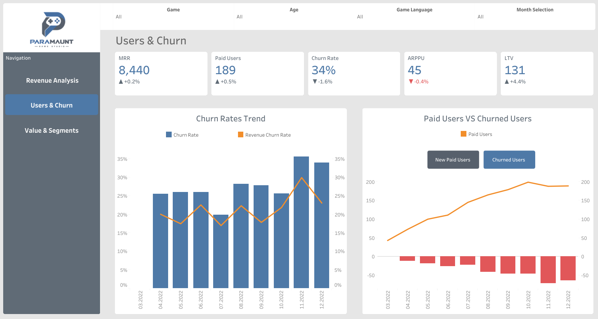
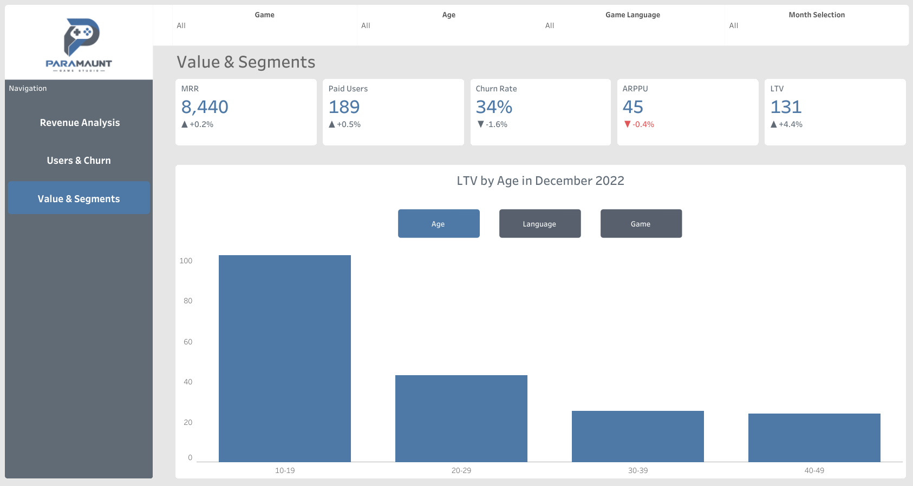

# Marketing Performance Dashboard

## 📌 Summary
- **Objective:** Develop an interactive marketing dashboard for revenue analysis.
- **Impact:** Enables marketing managers to track trends in revenue changes, conduct high-level analysis of the factors driving these changes.
- **Interactive Dashboard:** [Tableau Public Dashboard](https://public.tableau.com/views/project_17894202470270/RevenueAnalysis)

## 🛠️ Tech Stack & Tools
- **Database:** PostgreSQL
- **Visualization:** Tableau Public Desktop
- **Languages:** SQL

## 📂 Project Structure
```text
project/
├── images/         # dashboard images
├── queries/        # SQL queries
├── workbooks/      # tableau workbook
└── README.md
```

## 🗃️ SQL Architecture
1. **Data consolidation:** Joined data and aggregated to one row per user per calendar month.
2. **Data enrichment:** Attached user-level attributes to each monthly revenue record.
3. **Time-series preparation:** Calculated calendar month boundaries using window functions.
4. **Metric derivation:** Flagged churn and new-user statuses, calculated expansion and contraction.

## 📊 Dashboard View & Features

*Revenue analysis*


*Users & Churn rates*


*Value & Segments*

- **Revenue Analysis:** Revenue movement chart with a parameter-driven selector, paired with a dual-axis ARPPU vs LTV time series.
- **Users & Churn:** User movement chart with a parameter-driven selector, paired with a Churn Rate vs Revenue Churn Rate dual-line trend.
- **Value & Segments:** LTV by segment, with a parameter-driven segmentation selector.
- **KPI Cards:** Persistent across all tabs, showing latest-month value with percentage change vs the prior month.
- **Filtering:** Global controls for `Game`, `Age`, `Game Language`, and `Month of Year` across all tabs. 
- **Navigation:** Tab navigation buttons allow switching between "Revenue Analysis," "Users & Churn," and "Value & Segments" views.

## 💡 Insights
> [!NOTE]
> **Insight 1:** November marked a simultaneous deterioration in customer *acquisition* (decline in new paid users and new MRR) and *retention* (increase in churned users, churn rate, and churned revenue). These changes coincided with a reversal in the previous positive MRR and paid user trends. 
>
>**Recommendation:** Cross-check November against known external factors and segment the decline by game/language/age to confirm whether it's concentrated in a specific segment.

> [!NOTE]
> **Insight 2:** December shows a partial recovery toward pre-November levels, with new MRR and churn rate improving, but not yet to the October baseline.
>
> **Recommendation:** Monitor January's metrics to confirm whether December's change is a genuine reversal or a temporary bounce.
